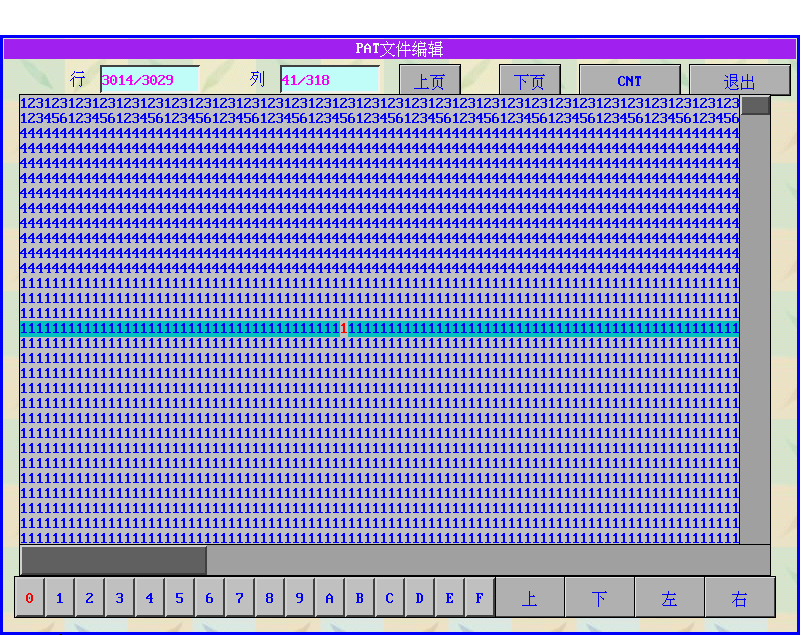

# 2.2 PAT文件编辑说明

1\)        行、列

显示当前光标的坐标。点击行号可以输入需要跳转的行号，快速到达指定行。

2\)        上页、下页

进行整屏切换。

3\)        退出

退出当前PAT编辑界面。

4\)        屏中数字

上图中间的数字部分代表花版行数据。行号依次自下而上。焦点处行号和列号在上面的输入框中显示。如果要进行修改，点击下面0－F按钮，就可以将焦点位置改成相应的数值。

5\)        上、下、左、右 对红色光标位置进行移动。

