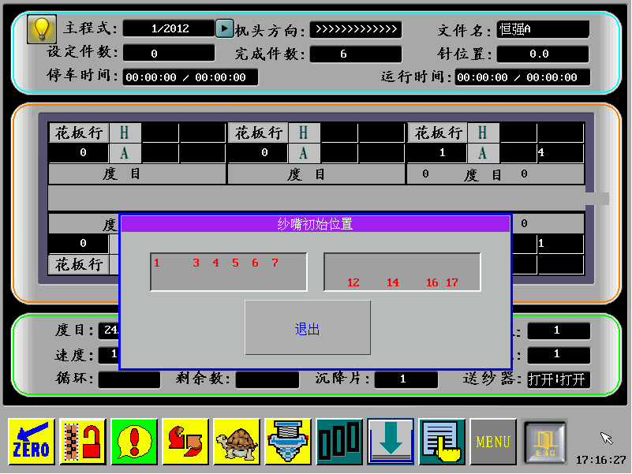
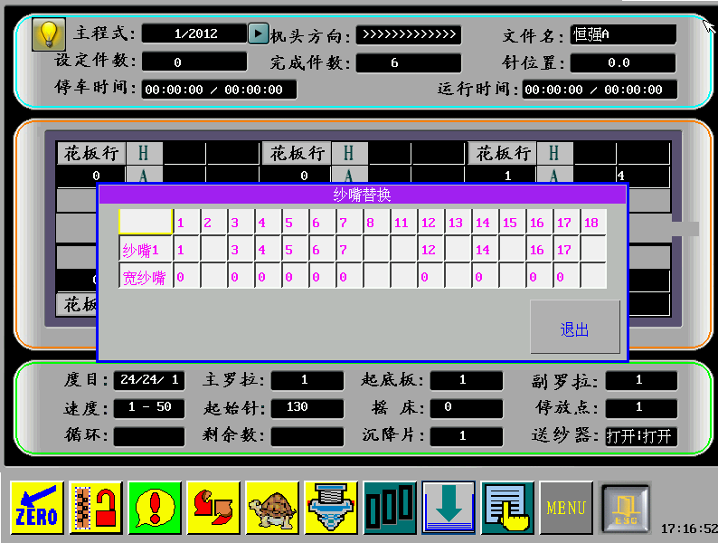
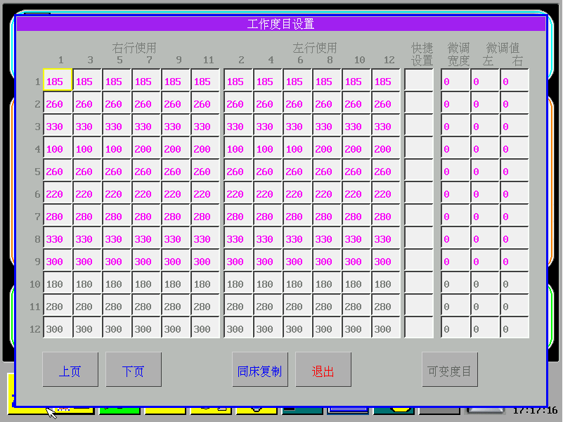
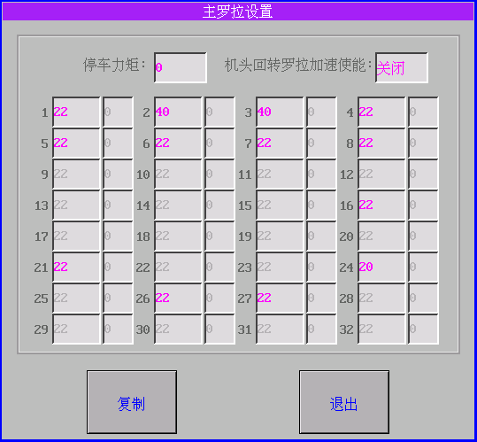
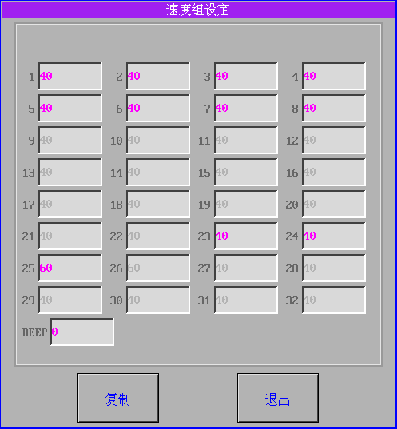
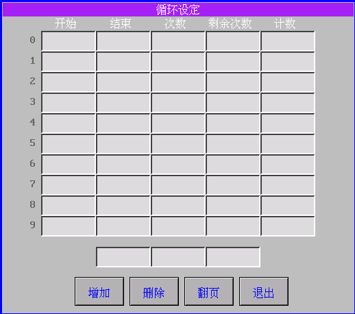
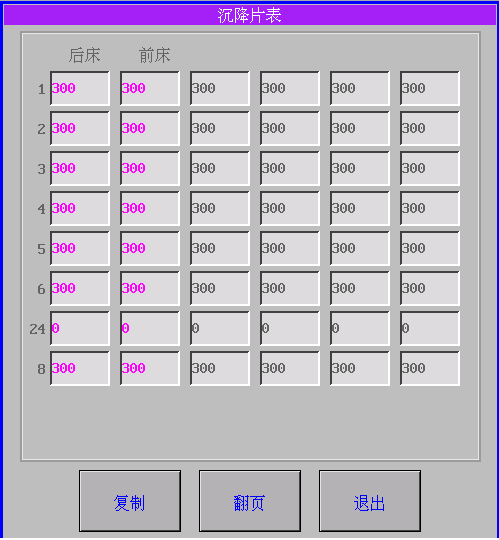

# 9.3 运行界面详细操作说明

### 1.报警显示

系统在运行中出现故障或者其他需要事件，会在画面的下方显示一红色的状态框，并文字描述报警信息。如“前床撞针报警”、“拉杆启动错”等。用户可以将拉杆旋转至停车档清除报警消息。

### 2.系统在运行过程中可以实时修改运行参数。

### 3.设定件数

点击运行画面的**“设定件数”**显示区域，用户可以输入设定的件数，到达设定的件数系统会自动停下并提示用户**“设定件数到”**。设定件数要大于当前已经完成的件数。

### 4.纱嘴初始位置

点击运行画面中央的**“纱嘴”**，系统会弹出窗口：

表示1,3,4,5,6,7号纱嘴初始位置在左边，12,14,16,17号纱嘴初始位置在右边。

### 5.纱嘴增加、删除

**增加**：在上面的纱嘴初始位置窗口里，点中某一显示的纱嘴，比如纱嘴1，弹出下面窗口。表示从“开始行”到“结束行”，“纱嘴号”跟随点中的纱嘴1。“开始行”，“结束行”，“纱嘴号”输入完成后，点击**“增加”**按钮。

 **删除**：表示从“开始行”到“结束行”去除“纱嘴号”。

### 6. 纱嘴替换

点击纱嘴两侧纱嘴号区域，会弹出纱嘴替换窗口。

左侧**“纱嘴替换1”**表示左片纱嘴替换，右侧**“纱嘴替换2”**表示右片纱嘴替换（设置多片编织以后）。

**操作方法**：

如果想把2号纱嘴用3号纱嘴替换，则点击第二个框内数字2，然后在软键盘输入3点击确定，然后退出即可。 

**注意**：

不能用正在使用中的纱嘴去替换，否则退出时系统会提示“**纱嘴替换错”**。纱嘴替换1的替换结果将保存到相应的CNT文件里去。因此在进行了“纱嘴替换1”操作后，“纱嘴替换2”的替换操作结果将取消。

### 7.工作度目设置

点击**“度目”**显示区域可以进行工作度目设置。系统可支持32段度目设置，每页显示12段，可以通过**“翻页”**按钮切换。

用户可以对某一单独的工作度目进行设置，也可以通过右侧的**“快捷设置”**，把本段度目一次设置成相同的值，注意23段度目为翻针时的度目，24段为空行时的度目。

#### 微调宽度和微调值

可变度目是在打开可变度目功能以后，工作到可变度目行可以查看可变度目区域，针数范围。   
其中花样中使用到的度目段为红色字体显示，不使用的度目段为灰色字体显示。该显示方式其他花型参数通用。

### 8.主罗拉设置

点击**“主罗拉”**区域弹出窗口进行主罗拉设置。上面是**“停车力矩”**输入框。下面输入框可以单独设置，也可以输入其中一个后\(此时该框有红色线框圈起来\)，点击**“复制”**按钮，即可把所有的段设置成同样的值。 

### 9.副罗拉设置 

   方法同“主罗拉设置”

### 10.速度组设定

点击**“速度”**区域进行速度组设定。同样用户可以单独设置某一段速度，也可以通过**“复制”**按钮把所有的值设置成当前的值，注意24段为机器空行时的速度，一般可以设置快速。

### 11.起始针

显示工作参数中起始针信息，点击可以更改起底板预勾纱有效针数。  
起始针大于预勾纱有效针数，橡筋带入起底行会进行预勾纱处理。

### 12.摇床

显示当前花样行针板摇床信息。

### 13.停放点 

显示纱嘴停放设置信息，点击修改纱嘴停放点位置。

系统支持8段纱嘴停放点设置。用户可以通过**“翻页”**按钮选择要设置的段，然后对输入框进行编辑。

### 14.循环设定

点击运行画面下面的循环显示区域，弹出循环设置窗口。其中每一行的三个输入框构成一个循环：开始行，结束行，循环次数。

其中开始行号为奇数，结束行号要为偶数。循环的排列式按照结束行的从小到达顺序排列的。

根据实际需要，系统目前设置支持10个循环。循环的初始信息在花样文件的PRM文件里。

设置方法：如果要增加一个循环，在最下面一行输入框里分别输入合法的开始行结束行循环次数值，然后点击“增加”按钮，如果输入的循环合法，则新增加的条目会现在在上面的循环表中。删除的时候，点击待删除行的任何一个输入框，右边的箭头会指向本行，然后按下方的“删除”按钮即可删除本行。“次数”列的值可以直接修改。 系统支持2重循环嵌套，循环层次大于2的系统将提示错误。

### 15.沉降片 

显示沉降片分段信息。点击修改不同段沉降片数值。

### 16.送纱器 

显示送纱器工作状态，点击可以修改送纱器工作使能。

