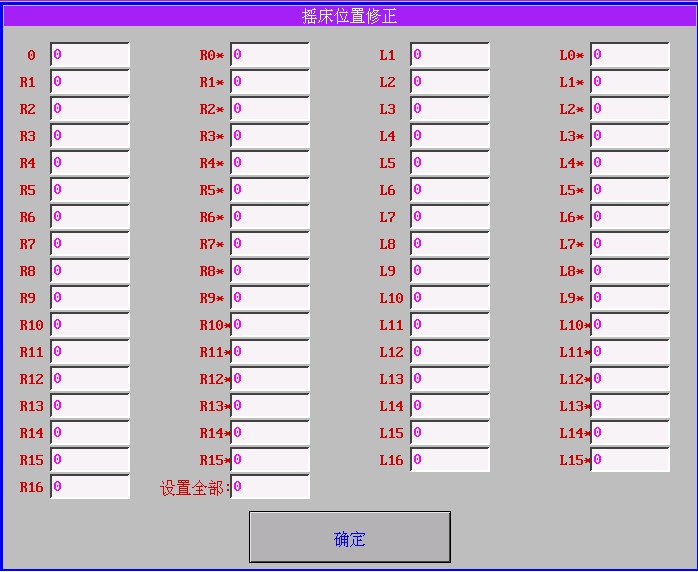
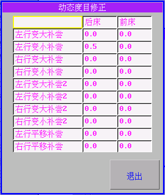

# 3.2 系统参数功能按钮

1. 系统参数保存到CF卡

为防止系统参数因意外原因而丢失，可以将系统参数保存到CF卡上。点击“系统参数保存到CF卡”按钮保存系统参数到CF卡上。每次设置参数并保存后，系统也会自动将设置后的系统参数保存到CF卡。

2. 从CF卡读入系统参数

点击“从CF卡读入系统参数”按钮，可以将保存在CF卡上的系统参数恢复到系统中。

3. 系统参数写入到U盘

点击“系统参数写入到U盘”，可以将系统参数保存到U盘。保存的文件使用默认的文件名，因此只能保存一份参数，如果用同一张U盘在不同机器上做此操作，后面的操作将把前面保存的参数覆盖掉。

4. 从U盘读入系统参数

点击“从U盘读入系统参数”按钮，可以将保存在U盘上的系统参数恢复到系统中。

5. 摇床修正 点击“摇床修正”按钮，打开一个全屏画面，分别有“摇床位置修正”，“翻针\(T\)摇床位置修正”，“翻针\(+\)摇床位置修正”，“翻针\(－\)摇床位置修正”功能按键。

5.1 摇床位置修正

摇床工作时的位置误差修正，修正单位：脉冲

点击相应的摇床位置的输入框，摇床会根据根据原来的设置\(脉冲数\)值移动摇床，如果位置不准，可以手动输入适当的值，直至摇床达到正确位置为止。

其中点击“设置全部”输入框然后输入相应的值，会一次把所有的框设置成的相同的值

5.2 翻针摇床位置修正 点击“翻针摇床位置修正”，弹出画面：

其操作方式同上

“翻针\(+\)摇床位置修正”，“翻针\(－\)摇床位置修正”也是依照上述设置方法。

“翻针\(+\)摇床位置修正”，“翻针\(－\)摇床位置修正”需要配合制版摇床功能线使用，功能线设置+位、-位摇床以后，摇床修正根据这两张表取值。

6. 连杆电机设置

6.1 连杆修正

对每个系统的换向连杆零位修正。

6.2 连杆电机正数/负数补偿

连杆电机左右行补偿。正数代表正转，负数代表反转，默认正反转各100 步，正数填10 代表正转110 步，-10 正转只有90步，相当于让连杆多走和少走。

6.3 连杆电机电流

连杆电机使用的电流。

0 为默认2000,如果感觉电机力不足可以加大电流。

6.4 动作电机电流

动作电机工作电流，我司默认1600。

7. 度目设置

7.1 单面度目零位修正

点击窗口中的“单面度目零位修正”。弹出画面：

单面织物编织时前、后密度马达零位修正。

修正设置有正负值，正数：织物密度松，负数：织物密度紧。

7.2 四平度目零位修正

双面织物编织时前、后密度马达零位修正。

修正设置有正负值，正数：织物密度松，负数：织物密度紧。

本系统自动判断单面、四平组织所需要的度目修正表。

7.3 不工作度目

设置编织或者翻针过程中不工作的马达度目值（先行度目）。

不工作度目：机头运行过程中先行不参与成圈工作的度目。

默认：度目原点（零位）。

7.4 动态度目设置

7.5 沉降片修正 

设置沉降片修正值，右系统修正为R、左系统修正为L

7. 设置IP地址

根据用户的网络配置情况配置相应的IP地址和MASK掩码。其中MASK的缺省值为255.255.255.0。用户需要为每台需要联网的机器指定一个唯一MAC地址。MAC地址可以用系统予以生成：点击“生成MAC地址”按钮，系统随机生成并显示一个合法的MAC地址。一般而言生成的MAC地址发生冲突的可能性极小，一旦与用户的子网内其他电脑或者横机控制系统的MAC地址发生冲突，重新生成一次即可。设置完成后需要保存，新的设置需要在本系统重新启动以后生效。

8. 配置选择

根据机器的硬件所选择配置

