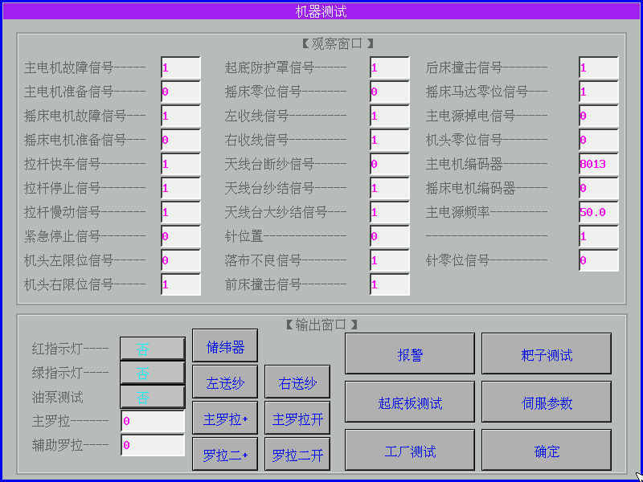
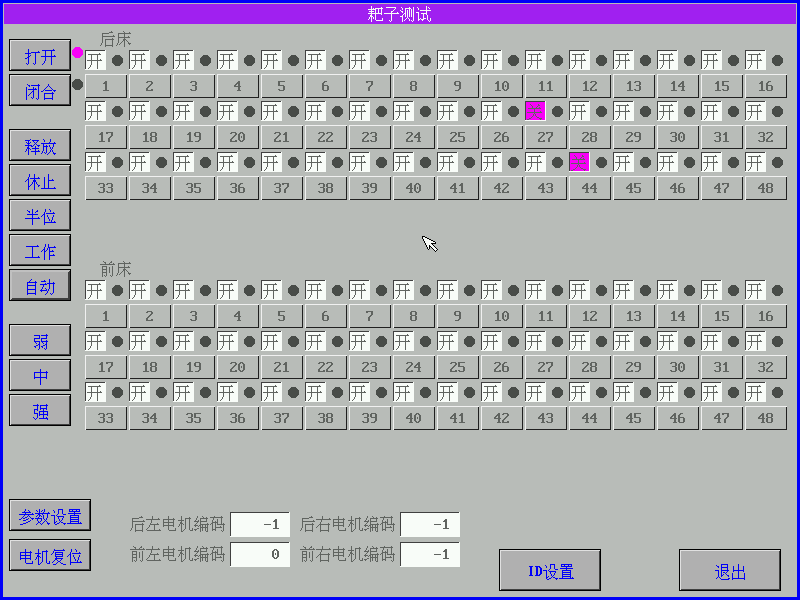
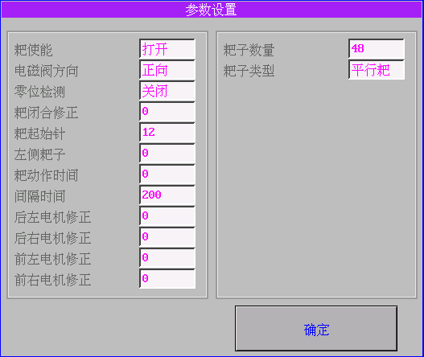
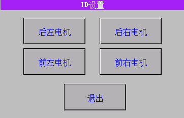

# 11.1  耙子测试

### 
1.进入菜单→机器测试→耙子测试**↓**

1. （打开）控制耙子打开动作
2. （闭合）控制耙子闭合动作
3. （释放）释放所有耙子使能
4. （休止）根据耙子结果调节（保留）
5. （半位）耙子工作1/2位置
6. （工作）所有耙子到工作位
7. （自动）耙子自动逐个测试
8. （弱）无
9. （中）靠耙子自重
10. （强）靠耙子自重和弹簧拉力

### 
 2.参数设置**↓**

1. （耙使能）有打开和关闭选择
2. （电磁阀方向）根据电磁阀类型可更改电磁阀方向
3. （零位检测）耙子的零位检测可选择打开和关闭
4. （耙闭合修正）可伊奥姐数值来修正耙子闭合松紧度（电机               只能一个方向修正）
5. （耙子起始针）从最左侧第一个耙子左边到针板最左外侧第一枚针
6. （左侧耙子）单床耙子的一半的数量
7. （耙子动作时间）耙子连续工作时间
8. （间隔时间）根据耙子分组来区分1号耙和3号耙工作相隔时间
9. （后左电机修正）无
10. （后右电机修正）无
11. （前左电机修正）无
12. （前右电机修正）无
13. （耙子数量）单床耙子的总个数
14. （耙子类型）根据机械上安装耙子类型来选择

### 3.参数设置：四个耙子电机到复位状态

### 
4.ID设置**↓**

在ID设时电机需要逐个设置：单个电机电源和通讯连接好（比如：连接的第一个电机为后左电机就点击显示屏上后左电机，这样就设置完成）单个设置好后需要断电机通讯和电源，再连接第二个电机；四个电机需要四次操作完成。

