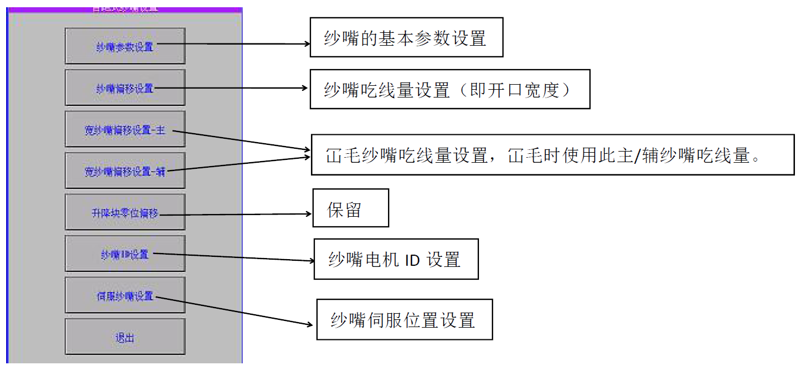
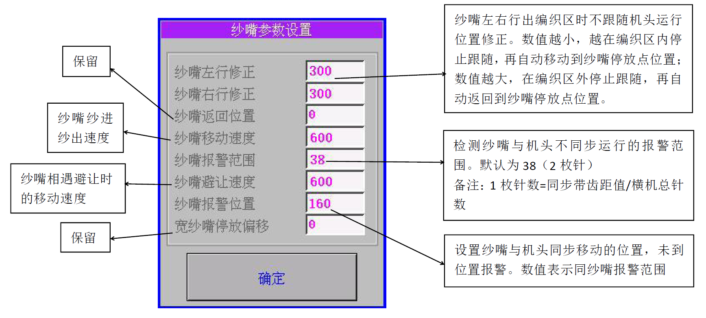
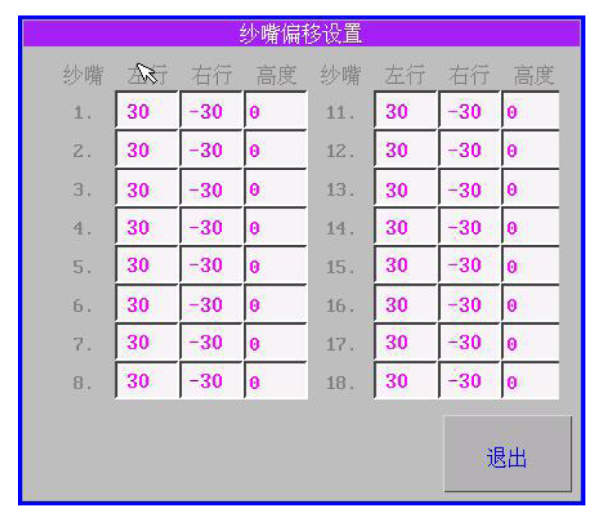
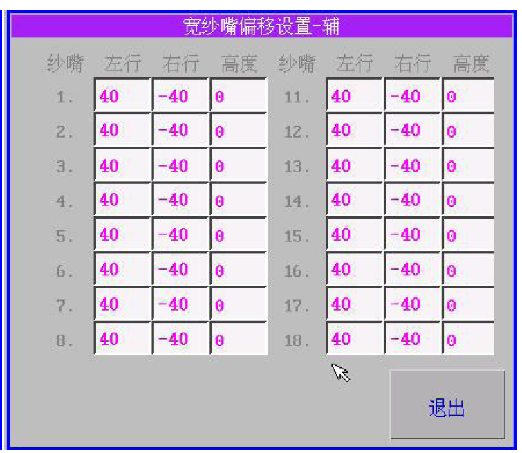
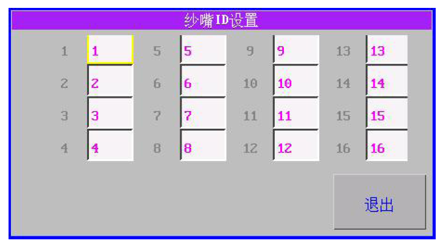
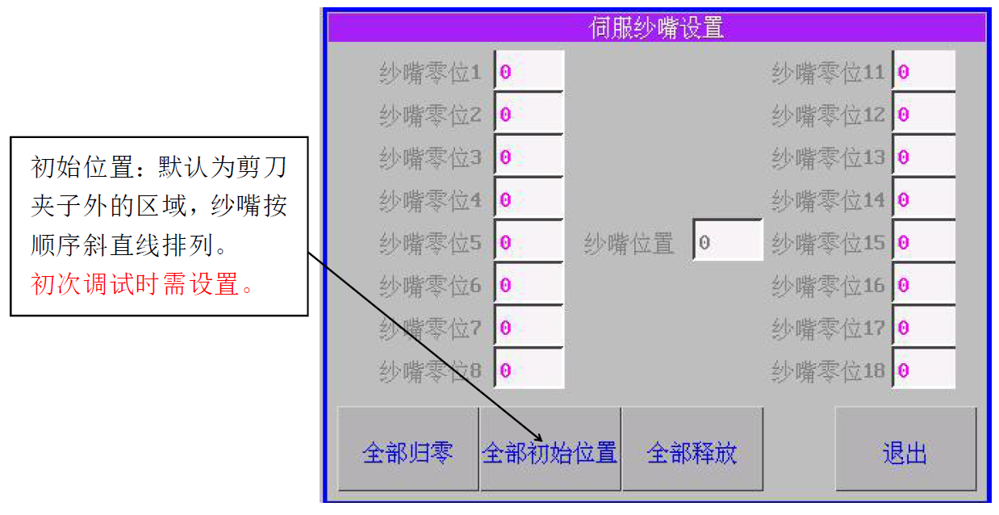
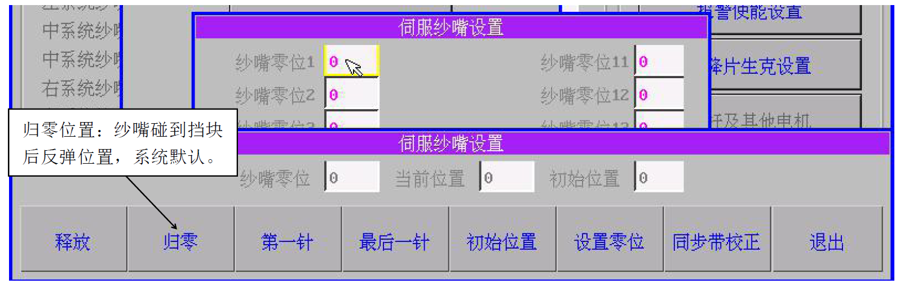
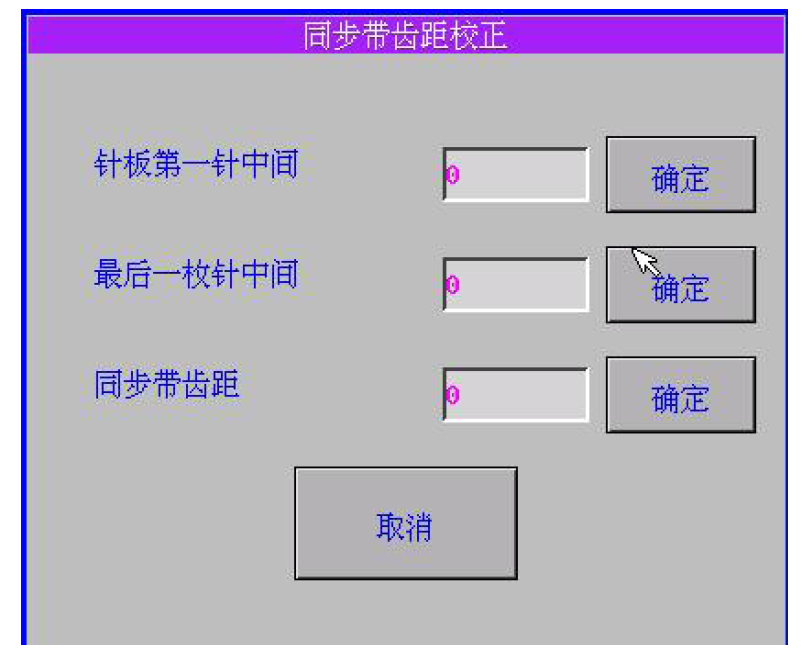

# 自跑纱嘴设置

### 1. 点击“自跑纱嘴”，弹出“自跑式纱嘴设置”画面。

### 2. 纱嘴参数设置

填入如图所示默认参数值。

### 3. 纱嘴偏移设置：

默认为左行30；右行-30

### 
4. 宽纱嘴偏移设置主/辅：

默认为主\(左行20；右行-20\)，辅\(左行40；右行-40\)   

若需加宽N，则左行填为20+N；右行填为-20-N；  
若需减窄N，则左行填为20-N； 右行填为-20+N

### 5. 纱嘴ID 设置

默认状态，纱嘴电机装配顺序如图示

### 6. 伺服纱嘴设置

**步骤1**：点击2 次 \[纱嘴零位1\] 后数值框，弹出**“伺服纱嘴设置”**对话框

点击**“同步带校正”**，弹出**“同步带齿距校正”**：先移动纱嘴到第一枚针正中间，点击 \[确定\] ，再移动纱嘴到最后 一枚针正中间，点击 \[确定\] ，再点击同步带齿距后 \[确定\] ，最后点击 \[归零\] 。

**步骤2**：点击 \[第一针\] ，检查纱嘴是否在第一枚针的中间位置。如果在，就点击 \[设置零位\] ，如果没在，点击 \[释放\] ，移动纱嘴到第一枚针的中间位置，再点击 \[设置零位\] 。

**注意**：

左侧纱嘴都设置“第一针”零位；右侧纱嘴都设置“最后一针”零位。

**步骤3**：完成后，点击 \[归零\] ，再点击 \[释放\] ，移动纱嘴到初始位置，点击 \[初始位置\] ，点击 \[退出\]，完成当前纱嘴伺服设置。

**步骤4**：重复步骤1-3 设置其它纱嘴。

**备注**：

1.纱嘴零位1------8 为左侧8 把纱嘴；纱嘴零位11------18 为右侧8 把纱嘴  
2.左右每把纱嘴零位都要设置。

**说明**：

1.做片操作中需要移动纱嘴，点击所有纱嘴可移动，再次点击恢复到原来位置。

2.相同机型调试多台时，只需先导入调试好的机型的参数，再设置“伺服纱嘴设置”项即可。

3.纱嘴电机报警号可参照（伺服说明书\)

